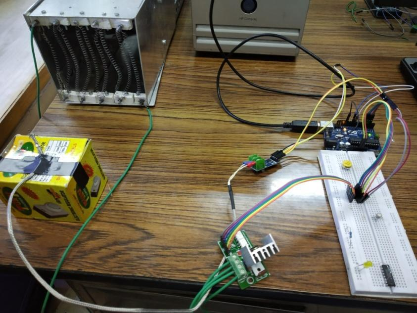

# **PID Controller Tuning for Temperature Regulation**

This repository contains the code, experimental setup details, and results of a project focused on PID controller tuning for a temperature regulation system. For an in-depth understanding of the project, please refer to the attached project report PDF.

---

## **Repository Contents**

### 1. **Project Report**
- The detailed project report (`PID_Tuning_Project_Report.pdf`) is included in the repository. It covers:
  - Background and Objectives
  - Experimental Setup and Components
  - Various PID Tuning Methods (MATLAB PID Tuner, Skogestad’s Method, Ziegler-Nichols, etc.)
  - Results and Discussion
  - Conclusions and Recommendations

---

### 2. **Code**
The repository includes the Arduino code for implementing the PID controller and interfacing with sensors and actuators.

- **`arduino_code/PID_Controller.ino`**  
  Contains the Arduino implementation, including:
  - Integration of MAX6675 thermocouple sensor
  - Control logic for the heating element using a dimmer
  - PID parameters for different tuning methods

---

### 3. **MATLAB Scripts**
MATLAB scripts for simulation and analysis.

- **`matlab_code/step_response.m`**  
  Simulates and plots the step response of the plant for PID tuning.

- **`matlab_code/pid_tuning.m`**  
  Uses MATLAB’s PID Tuner toolbox and Skogestad’s tuning method to determine optimal PID parameters.

    
  _Caption: MATLAB PID tuning results showing step response and settling times._

---

### 4. **Experimental Setup**
Details about the physical setup and components used in the project. Refer to the `project_report.pdf` for comprehensive details.

- **Components:**
  - Heating element (Nichrome)
  - Fan (120mm x 120mm, 100 CFM)
  - Duct (Aluminum, 125mm x 125mm x 225mm)
  - K-type Thermocouple with MAX6675
  - Arduino UNO
  - Digital Dimmer Module

#### **Circuit Diagram**
The circuit diagram represents the connections between the components, including the Arduino, thermocouple, heating element, and dimmer module.

  
_Caption: Circuit diagram showing the connections between the Arduino, temperature sensor, and heating element._

#### **Experimental Setup**
This image provides an overview of the physical arrangement of the components in the experimental setup. It demonstrates how the heating element, fan, duct, and thermocouple are placed within the experimental environment for effective temperature regulation.

  
_Caption: Schematic of the experimental setup showing the components used for temperature regulation._

---

### 5. **Results**
Graphs and performance metrics for various tuning methods.

- **MATLAB PID Tuner Results**  
  - Settling Time: 50 seconds
  - Rise Time: 16 seconds
  - Overshoot: 20.9%

    
  _Caption: Performance results from MATLAB PID Tuner, showing settling time, overshoot, and rise time._

- **Skogestad’s Method**  
  - Settling Time: 47 seconds
  - Rise Time: 6 seconds
  - Overshoot: 20.93%

    
  _Caption: PID tuning results using Skogestad’s method, with fast rise time but higher overshoot._

- **Relay Tuning Method**  
  - Settling Time: 143.27 seconds
  - Rise Time: 129.06 seconds
  - Overshoot: 1.744%

    
  _Caption: Relay tuning results with minimal overshoot but slower settling time._

- **Ziegler-Nichols Open Loop Method**  
  - Settling Time: 46.62 seconds
  - Rise Time: 45.48 seconds
  - Overshoot: 1.744%

    
  _Caption: Ziegler-Nichols tuning method showing balanced settling time and overshoot._

---

### 6. **Conclusion**

From the simulations, we conclude that different PID tuning methods can be chosen based on the specific requirements of settling time, overshoot, and rise time. The following cases highlight which tuning methods are preferred for specific needs:

| **Case**  | **Objective**                                      | **Settling Time** | **Overshoot** | **Preferred Tuning Method** | **PID Parameters**                    |
|-----------|----------------------------------------------------|-------------------|---------------|-----------------------------|---------------------------------------|
| **Case I** | Minimize Settling Time, Less Focus on Overshoot   | 47 seconds        | 20.93%        | **Skogestad’s Method**       | Kp = 2, Ki = 6.92, Kd = 0.082        |
| **Case II** | Minimize Overshoot, Less Focus on Settling Time   | 143.27 seconds    | 1.44%         | **Relay Tuning Method**      | Kp = 2, Ki = 0.644, Kd = 1.548       |
| **Case III** | Balance Between Settling Time and Overshoot      | 46.62 seconds     | 1.44%         | **Ziegler-Nichols Open Loop**| Kp = 1, Ki = 1.5625, Kd = 0.016      |

---

## **How to Run**

1. **Clone this repository**:
   ```bash
   git clone https://github.com/arekhtiwari/PID-Controller-Tuning.git
   ```

2. **Arduino Code**:
   - Open `arduino_code/PID_Controller.ino` in the Arduino IDE.
   - Upload to the Arduino UNO.
   - Connect the components as described in the experimental setup.


3. **MATLAB Simulations**:
   - Run the MATLAB scripts in the `matlab_code` folder to simulate and analyze the system.

---

For full project details, refer to the attached **`PID_Tuning_Project_Report.pdf`**.

